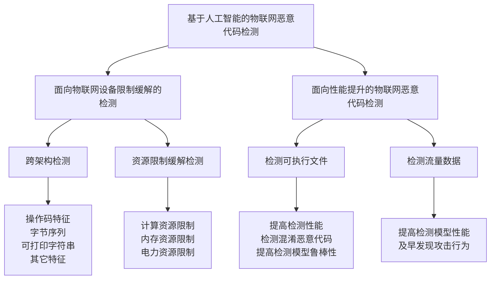

---
{"dg-publish":true,"permalink":"/czc知识库/4-硕士研究生/科研/1-文献阅读笔记/8-恶意代码检测综述类/202306.综述：基于人工智能的物联网恶意代码检测的文献综述/","dgPassFrontmatter":true,"created":"2024-06-18T17:45:26.905+08:00","updated":"2024-12-08T12:30:21.288+08:00"}
---

***
- 时间:: 2023
- 作者:: 刘奇旭, 刘嘉熹, 靳泽, 刘心宇, 肖聚鑫, 陈艳辉, 谭耀康
- URL:: [知网](https://kns.cnki.net/kcms2/article/abstract?v=AnuRcxOpZiEZSPlVE9c9xgWFA3ybNpNaaaksB3isLDhMBa9QaN6WRxi2CYYpwCDWhQdWrKInxEQhDkiXyfq48V6pcvGV_qnmYbpknG87zDT-7CEoaj_N_BM9DaQ-TkVH&uniplatform=NZKPT&language=gb)
- DOI:: 
- pdf链接:：[基于人工智能的物联网恶意代码检测综述_2023_刘奇旭 et al.pdf](基于人工智能的物联网恶意代码检测综述_2023_刘奇旭%20et%20al.pdf)
- zotero链接:： [基于人工智能的物联网恶意代码检测综述_2023_刘奇旭 et al.pdf](zotero://open-pdf/library/items/MPQVAJV3)
- 标签:: #机器学习 #物联网 #综述 #恶意代码检测
***
>[!note]- 来源：不知道

计算机研究与发展
这篇文章也是三区的文章
一般视为等同于**SCI3区**。

---
参考文献48，物联网恶意代码分析联邦学习综述，下来看
笔记

参考文献72，三区的啊，不看？，下来看看：20231229
MDABP: A novel approach to detect crossarchitecture  IoT  malware  based  on  PaaS
笔记

参考文献111，中科院双一区，Hybrid malware detection based on BiLSTM  and  SPP-Net  for  smart  IoT
这篇不错啊感觉，，
ccfa，顶刊（CCF推荐中文科技期刊目录——A类）

---
20231217组会汇报的
这篇文章哪找的？不记得了
一篇基于人工智能的物联网恶意代码检测的文献综述（中科院信息工程研究所）

这篇综述通过对2018年以来在网络与信息安全领域顶级会议和期刊上发表的物联网恶意代码检测相关研究的调研，详细分析了这些研究工作的问题、贡献、采用的机器学习和深度学习算法、物联网恶意代码数据集以及检测效果。然后这篇综述研究提出了一种新的分类方法，从物联网检测研究的主要动机的角度出发，区分了两大类研究，一类侧重于解决物联网设备特有的架构和资源限制引发的恶意代码检测挑战，另一类致力于提高检测模型的性能（准确率）。

## Abstract

近年来，随着物联网（Internet of things, IoT）设备的大规模部署，针对物联网设备的恶意代码也不断出现，物联网安全面临来自恶意代码的巨大威胁，亟需对物联网恶意代码检测技术进行综合研究.随着人工智能（artificial intelligence, AI）在计算机视觉和自然语言处理等领域取得了举世瞩目的成就，物联网安全领域也出现了许多基于人工智能的恶意代码检测工作.通过跟进相关研究成果，从物联网环境和设备的特性出发，提出了基于该领域研究主要动机的分类方法，从面向物联网设备限制缓解的恶意代码检测和面向性能提升的物联网恶意代码检测2方面分析该领域的研究发展现状.该分类方法涵盖了物联网恶意代码检测的相关研究，充分体现了物联网设备独有的特性以及当前该领域研究存在的不足.最后通过总结现有研究，深入讨论了目前基于人工智能的恶意代码检测研究中存在的问题，为该领域未来的研究提出了结合大模型实现物联网恶意代码检测，提高检测模型安全性以及结合零信任架构3个可能的发展方向.

# 0 介绍

## **本文的物联网领域恶意代码检测分类：**

- 面向物联网设备限制缓解的恶意代码检测
- 面向性能提升的物联网恶意代码检测

## **物联网设备安全问题**：
使用弱口令、不及时更新安全补丁

## 传统和现代物联网恶意代码检测技术方法区别
**传统物联网恶意代码检测**：特征库的积累和恶意软件分析人员的人工分析
**现在物联网恶意代码检测**：人工智能应用于恶意代码检测
> 传 统 的 物 联 网 恶 意 代 码 检 测 和 设 备 保护方法主要依靠特征库的积累和恶意软件分析人 员的人工分析，但是由于恶意软件的爆发式增长[4,6–10]， 传 统 方 式 缺 乏 效 率 且 难 以 应 对 未 知 的 安 全 风 险. 安 全研究人员开始尝试将在图像分类、文本分析等领 域取得了巨大成功的人工智能（artificial intelligence, AI） 技 术 应 用 于 恶 意 代 码 检 测 领 域 并 得 到 了 很 好 的 效 果[11– 14]. 目前，基于人工智能技术的物联网恶意代码 检测研究逐渐成为主流. 但是，相较于传统的台式机、 服 务 器 等 设 备 ， 物 联 网 设 备 上 的 恶 意 代 码 检 测 技 术 不仅面临着基于人工智能的恶意代码检测技术普遍 需 求 更 高 检 测 准 确 率 等 问 题 ， 而 且 要 应 对 物 联 网 设 备自身特性引发的 2 大挑战[15]：1）物联网恶意代码能 够感染使用多种不同 CPU 架构的设备，而不同 CPU 架 构 的 指 令 集 不 同 ， 导 致 无 法 将 基 本 使 用 相 同 架 构 的传统设备中成熟的恶意代码特征提取和检测方法 直 接 应 用 到 物 联 网 恶 意 代 码 的 检 测 中. 2）由 于 物 联 网 设 备 一 般 体 积 较 小 ， 需 要 部 署 在 各 种 不 同 的 环 境 中，物联网设备受到内存空间小、电量少等资源限制， 需 要 部 署 相 对 于 传 统 设 备 更 轻 量 级 的 检 测 系 统. 因 此基于人工智能的物联网恶意代码检测研究在提高 模 型 的 检 测 效 果 的 同 时 ， 需 要 解 决 当 前 物 联 网 设 备 自身的特性带来的独特挑战
[传统和现代物联网恶意代码检测技术方法区别](基于人工智能的物联网恶意代码检测综述_2023_刘奇旭%20et%20al.pdf#page=2&selection=144,0,201,0)

## **物联网设备恶意代码检测面临的问题：**

- 需求更高检测准确率
- 物联网设备使用多种cpu架构（常用的有十多种），指令集不同
- 物联网设备资源限制，需要轻量级检测系统

# 1 研究背景

## 1.1 物联网相关概念及特性

物联网系统分为：感知层、网络层、应用层

物联网设备：硬件层、系统层、用户层

- 硬件层：常见cpu架构：ARM、MIPS、PowerPC（PPC）、SPARC、SuperH

这些架构均采用精简指令集，具有低能耗的特点，x86架构的高能耗与复杂性使其很少出现在物联网设备上

- 系统层：操作系统、应用程序
- 用户层面向用户提供交互界面并 接受用户控制.

物联网设备区别于传统台式机等设备的2个特性：

1、根据物联网设备的独特功能需求使用不同的 CPU架构，不同CPU架构所使用的指令集、寄存器 等也存在差异. 
2、物联网设备结构上的局限性导致大多数物联 网设备的内存容量较小，可分配的计算资源也相对 较少.” (刘奇旭 等, 2023, p. 4)

## 1.2 物联网恶意代码检测挑战

多cpu架构、资源有限

## 1.3 物联网恶意代码检测常用数据集
论文列出的IoT恶意代码常用数据集 （什么玩意↓一个找不到）

# 2 现有检测技术分类

2.1 现有分类技术

“2008年，针对物联网设备的恶意代码首次被发 现[41]，之后几年内才开始大规模出现并引起工业界 与研究人员的共同关注[42-43].” (刘奇旭 等, 2023, p. 5)

2.2 本文分类方法

# 3 面向物联网设备限制缓解的恶意代码检测
1-1、跨架构检测对物联网恶意代码检测的当前技术进行的对比。。当前解决物联网恶意软件跨架构问题的方法通过对不同 CPU上编译程序的分析研究，选取字节序列、可打印 字符串、控制流图等特征，并设计基于各种机器学习算法的检测模型，在大规模跨架构恶意样本数据集上得到了高准确率，这些方法存在当前大多数基于静态分析的跨架构检测方法无法应对混淆或加壳的恶意代码的不足，基于动态分析的跨架构检测方法存在着不可以统一部署的虚拟机环境等不足。
1-2、以解决物联网设备受到**计算资源**、**内存空间**以及**电力资源**等限制为研究动机的物联网恶意代码检测方法，这些技术中，大多侧重于解决资源限制问题，只在来自单一架构的数据集上训练和测试模型，没有在不同架构上编译的恶意程序中验证模型的检测效果，模型的鲁棒性和泛化能力有限。
## 3.1　跨架构检测技术
3.1.1　结合操作码的融合特征
3.1.2　字节序列
3.1.3　可打印字符串
3.1.4　其他特征
3.1.5　小　结

## 3.2　面向资源限制的检测技术
3.2.1　面向计算资源限制的检测技术
3.2.2　面向内存限制的检测技术
3.2.3　面向电力限制的检测技术
3.2.4　小　结

# 4 面向性能提升的物联网恶意代码检测
面向性能提升的物联网恶意代码检测技术对比，这些技术中的检测对象有二进制文件和流量数据，其技术重心放在提高准确率、检测混淆代码、提高鲁棒性、及时发现攻击行为上。
2-1、基于**可执行文件分析**的检测性能提升方法通过 利用深度学习方法自动提取特征，减少对专家知识 的依赖，提高检测模型的性能，但是当前的很多检测 研究没有考虑对抗样本等攻击对机器学习和深度学 习模型的安全威胁. 
2-2、使用基于流量分析的方法可以提高在物联网恶意代码的攻击早期阶段的检测性能。然而，由于攻击流量数据庞大，用于训练检测系统的数据集无法实时更新，这可能导致基于流量的检测系统的准确率随着时间的推移而下降。
4.1　基于可执行文件分析的检测性能提升
4.2　基于流量分析的检测性能提升
4.3　小　结

# 5 挑战与机遇
## 5.1 挑战

## 5.2 未来研究方向
- 引入AI大模型辅助物联网恶意代码检测
- 提高模型检测安全性（AI安全）
- 结合零信任架构实现检测（不信任任何设备或用户，实时认证和授权）

# 参考文献里挑几篇来看

hello