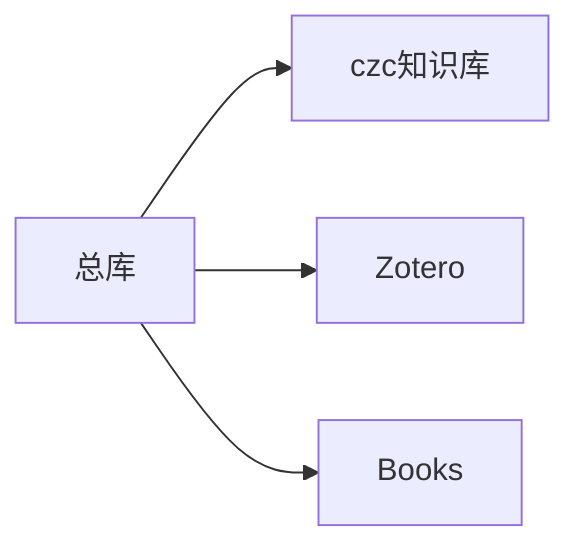

---
{"dg-publish":true,"permalink":"/czc知识库/笔记/个人知识库构建/czc知识库框架构建思路过程/","dgPassFrontmatter":true,"created":"2024-06-18T17:45:22.245+08:00","updated":"2024-12-08T16:10:32.110+08:00"}
---


本文是古代的东西了，这篇文章现在和我笔记没有多少关系了

原始的思路
下面的内容可以全部作废 了呀，现在大变样了啊啊啊

---
# 总体框架

[onesync用户手册](https://metactrl.com/userguide/?app=onesync)


20231219

根目录为czc的知识库（新建文件夹即可）
czc知识库从czc个人OneDrive中创建**目录联接**到新库位置
Zotero也是由**目录联接**，源文件在用学校教育邮箱注册的OneDrive中
使用mklink /j命令创建**目录联接**到本地文件夹，再用obsidian（typora一样）打开这个知识库
目录联接构建好的知识库复制走会全部文件都复制，复制品就是不带目录链接的版本，彻底融合版

命令写成脚本了在czc知识库.重构文件夹里

原先直接联接出根目录，在联接后的目录里联接zotero，这样实际联接位置是czc知识库源目录的位置，也就是OneDrive会上传到2个g的zotero文件库

临时：
现在总库大小就2.多g，直接全放个人网盘好了，这样手机也能看文献，那么在这个框架基础上，在个人OneDrive中联接个zotero，手机中直接把onesyncfiles作为总库文件夹，手机上就手动更新配置文件
[obsidian](obsidian.md)

20231220

zotero库中把所有电子书移出来（大幅减小空间），用教育OneDrive同步，知识库和文献用个人zotero同步，另外两个onedrive都移动到c盘根目录

三个源目录：
```
C:\OneDrive\OneSyncFiles\czc知识库

C:\OneDrive\OneSyncFiles\Zotero

C:\OneDrive - mail.jxust.edu.cn\Books
```

20231220-2
nonono
book占的大，但是书也不会很多，所以现在5gonedrive勉强够用，不够用再去用b站的方法扩容10g（已经去淘宝买了10g邀请扩容，现在有15g了）
so，
之前的框架不用了，直接三个源都放一起用onedrive同步成一个大知识库

20231221
总结一下手机新设备快速构建方法：
下载onesync登个人账号，同步到本地文件夹
下载obsidian打开文件夹，ok

# 为什么这么干？：
尝试过onenote、语雀、notion、印象笔记、wolai、typora、最后发现了obsidian，各有优缺点，最终选择obsidian，[做笔记工具对比收集 使用技巧 软件网站 OneNote、语雀、Notion、印象笔记](做笔记工具对比收集%20使用技巧%20软件网站%20OneNote、语雀、Notion、印象笔记.md)
我要实现所有设备都能同步，我发现了obsidian在Android上也能设文件夹为存储库。经过一天折腾，发现可行方案：
	手机使用onesync（<font color="#de7802">只能授权个人账户</font>，教育邮箱账户不行）同步czc的存储库到手机目录，用obsidian手机版识别目录并打开
	电脑使用两个OneDrive账户同步两个源文件，再用目录链接方法构建本地文件夹内的知识库框架

# 未来可能遇到的问题
OneDrive教育版研究生毕业后可能过期是用不了，但是个人OneDrive的10g还在，到时候可以用百度网盘的同步文件功能在电脑上同步zotero（反正<font color="#de7802">手机上的百度网盘也不支持同步到本地</font>）
今天他妈研究了一晚上
20231221
问题不存在了，onedrive搞到了15g，一直用，如果将来会超容量再拆分知识库

# 之前碰到的问题
onesync无法连接到Microsoft OneDrive账户
typora转obsidian后图片不识别问题：斜杠是反过来的（linux形式）
百度网盘无法同步到手机本地，可以在百度网盘app里看md文件
OneDrive无法同步到手机本地，甚至没法再软件内查看
文件路径组织问题（相对路径绝对路径）（so，现在用typora打开的问题应该只有图片不识别，需要手动替换斜杠方向）

# 知识库还想改进的地方
把现在OneNote的手动表格实现日程功能搬过来？但是这里是markdown，markdown如何实现？

