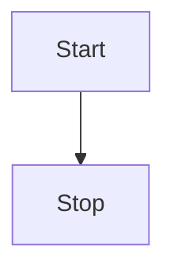

---
{"dg-publish":true,"permalink":"/czc知识库/笔记/个人知识库构建/绘图工具/","dgPassFrontmatter":true,"created":"2024-06-27T12:39:03.647+08:00","updated":"2024-12-08T11:31:16.743+08:00"}
---

[PKMer\_Mermaid 语法](https://pkmer.cn/Pkmer-Docs/02-%E7%9F%A5%E8%AF%86%E7%AE%A1%E7%90%86%E5%9F%BA%E7%A1%80/mermaid/mermaid%E8%AF%AD%E6%B3%95/)
## Mermaid
Mermaid 是一种开源的可交互式的数据可视化库，它使用 Markdown 标记语言来生成图表和流程图。它通常用于生成网站或文档中的图表。Mermaid 不属于任何公司，而是一个由社区开发和维护的开源项目。

学习 Mermaid 的好方法是访问它的官方网站，其中包含了详细的文档和教程。

官方网站：​ ​<https://mermaid-js.github.io/​>

在线调试： Mermaidv10.9.0 Live Editor

在这里，你可以找到有关 Mermaid 的基础知识、语法和用例的信息。此外，你还可以在该网站的“Examples”部分找到各种示例图表和流程图，以及如何使用 Mermaid 创建它们的代码。

简单的说 mermaid 就是一个在 Markdown 下画图的一个语法工具， 这种通过代码画图的方式，对小白不太友好，但一旦熟悉，比用鼠标画图要灵活方便的多。

创建 mermaid 只需要创建一个代码块语言选为 mermaid 即可比如这样

## 其他绘图工具
### draw.io
数学建模比赛用的
### ProccessOn
### Excalidraw
### OmniGraffle
### PlantUML
### Visio
微软的。。。。。一言难尽