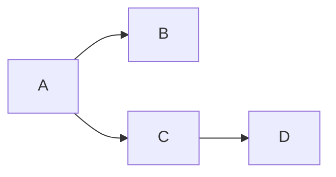

---
{"dg-publish":true,"permalink":"/czc知识库/笔记/知识库构建/typora使用笔记/","dgPassFrontmatter":true,"created":"2024-06-18T17:45:22.273+08:00","updated":"2024-12-08T11:32:40.590+08:00"}
---


# 网上找的各种技巧

[收藏-LaTeX公式书写 叶程轶发的](收藏-LaTeX公式书写%20叶程轶发的.md)
[Typora笔记教程 b站up主总结 markdown的使用说明 如何做笔记 + 习题](Typora笔记教程%20b站up主总结%20markdown的使用说明%20如何做笔记%20.md)
[typora各种链接跳转 做笔记 csdn复制](typora各种链接跳转%20做笔记%20csdn复制.md)

# 自己的总结

## 在学习资料内全部使用相对路径，方便文件转移

- 当前目录：.\ 或者
- 上一级目录：..\

## 搜索个人知识库的东西：

- 小技巧直接用everything搜（小技巧用单独小文件记录）
- 系统性的知识在学习资料根目录里用typora搜

## Typora如何折叠显示知识点内容

例子（点进去复制代码）：**里面不能回车换行啊**

<details>
  <summary>这个不能换行啊：点击时的区域标题：点击查看详细内容</summary>===
===```(删除括号)
===#define A B
===#endif
===void init(void)
===```(删除括号)
</details>
<details>
<summary>视频的评论</summary>
<pre><code>这个可以换行
但是不能有空行
</code></pre>
</details>
## 在typora如何链接其他md文件的某一段落

直接上例子，链接到详细介绍typora各种链接跳转技巧的文件的一级目录（注意使用#来跳转到文件内的标题）：[typora各种链接跳转 做笔记 csdn复制](typora各种链接跳转%20做笔记%20csdn复制.md)
## 文字加粗要加粗整个名词

不然搜索的时候有你好受

## 画流程图
**mermaid 这玩意牛大逼**
官方教程：[关于 Mermaid | Mermaid 中文网](https://mermaid.nodejs.cn/intro/)
输入\`\`\`mermaid然后敲回车，回生成一个空白图，然后可以开始敲代码
这个在obsidian中也支持
例如graph LR;A-->B;A-->C;C-->D（分号可以不写，但是要回车换行）		LR表示left-right从左到右，也可以TD（从上到下）




